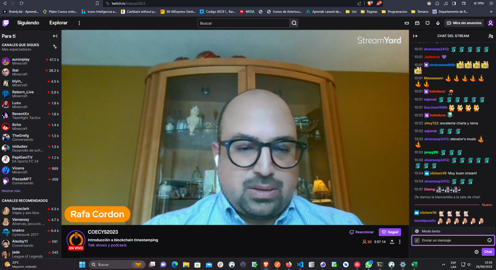

# Aprender a Desplegar tus Aplicaciones en GKE

En la conferencia se trató el tema Google Kubernetes Engine (GKE) es una plataforma de orquestación de contenedores basada en Kubernetes que simplifica el despliegue y administración de aplicaciones en contenedores. Dónde se profundizó en los siguientes aspectos.

## Ventajas de Utilizar GKE

### 1. Escalabilidad Dinámica

GKE permite la escalabilidad automática de tus aplicaciones. Con el uso de la función de escalado automático de Kubernetes, puedes definir políticas para ajustar automáticamente el número de réplicas de tus contenedores en función de la carga de trabajo. Esto asegura que tu aplicación sea altamente escalable para atender las demandas cambiantes de los usuarios.

### 2. Alta Disponibilidad

La alta disponibilidad es crítica para las aplicaciones en producción. GKE se encarga de distribuir tus aplicaciones en contenedores en diferentes nodos de la agrupación para garantizar que tu aplicación siga funcionando incluso en caso de fallas en un nodo.

### 3. Actualizaciones Sin Interrupciones

Con GKE, puedes realizar actualizaciones de tus aplicaciones de forma continua y sin interrupciones. Puedes utilizar despliegues con rollbacks automáticos y revisiones previas para asegurarte de que las actualizaciones no provoquen problemas en tu aplicación en producción.

## Cómo Empezar con GKE

### 1. Crear un Clúster de GKE

Lo primero que debes hacer es crear un clúster de GKE en Google Cloud Console. Puedes personalizar el número y tipo de nodos que compondrán tu clúster.

### 2. Desplegar tus Contenedores

Una vez que tengas tu clúster configurado, puedes utilizar herramientas como `kubectl` o las interfaces gráficas de GKE para desplegar tus aplicaciones en contenedores en el clúster. Asegúrate de crear archivos de definición de recursos como Deployment y Service para describir tus aplicaciones.

### 3. Monitoreo y Escalado

Utiliza las capacidades de monitoreo de GKE para rastrear el rendimiento de tus aplicaciones y ajustar las políticas de escalado automático según sea necesario. Puedes utilizar servicios como Stackdriver para obtener información detallada sobre el estado de tu aplicación.

### 4. Actualizaciones y Mantenimiento

Realiza actualizaciones y mantenimiento de tus aplicaciones de manera planificada. GKE proporciona funcionalidades como revisiones previas y despliegues canarios para garantizar que las actualizaciones sean seguras y sin interrupciones.

## Imágenes:

## Conclusión

1. Aprender a desplegar tus aplicaciones en GKE es esencial para aprovechar al máximo la escalabilidad 
2. Alta disponibilidad y capacidades de administración que ofrece esta plataforma de orquestación de contenedores.
3. Uuna configuración adecuada y una comprensión sólida de sus características, puedes garantizar que tus aplicaciones funcionen de manera eficiente y confiable en GKE.
