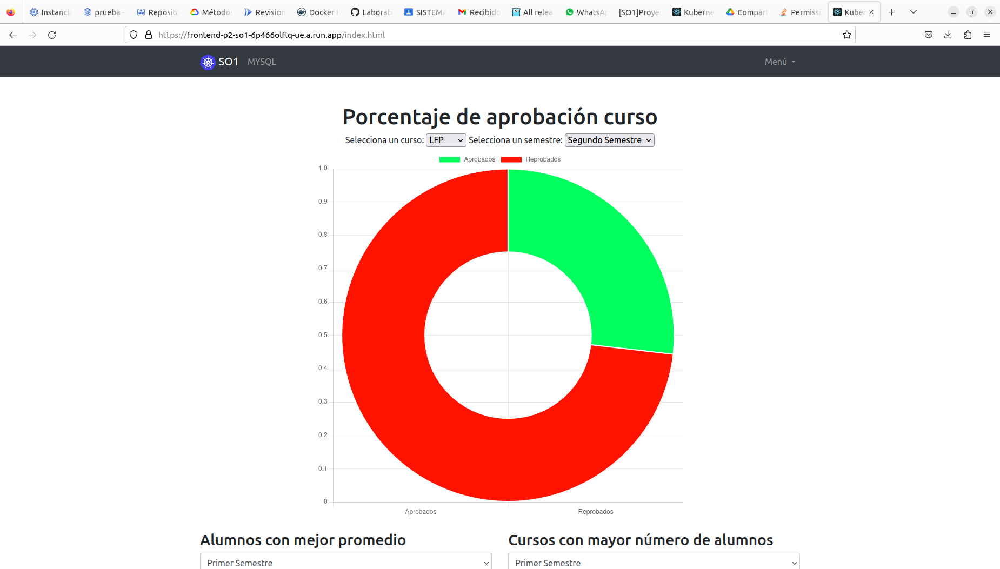
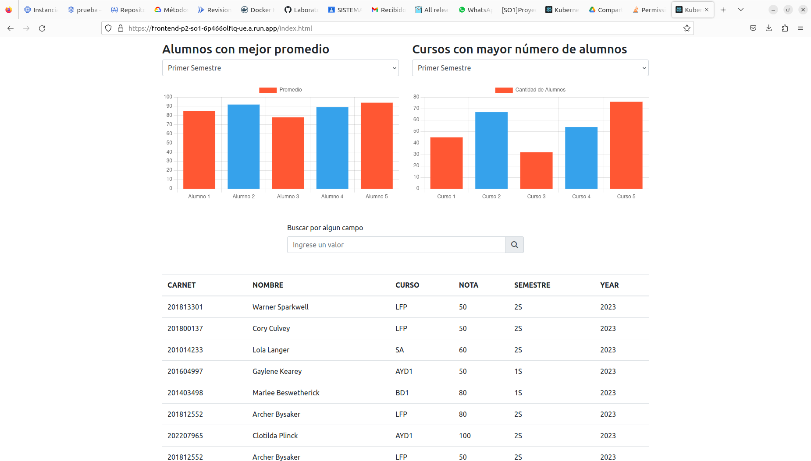
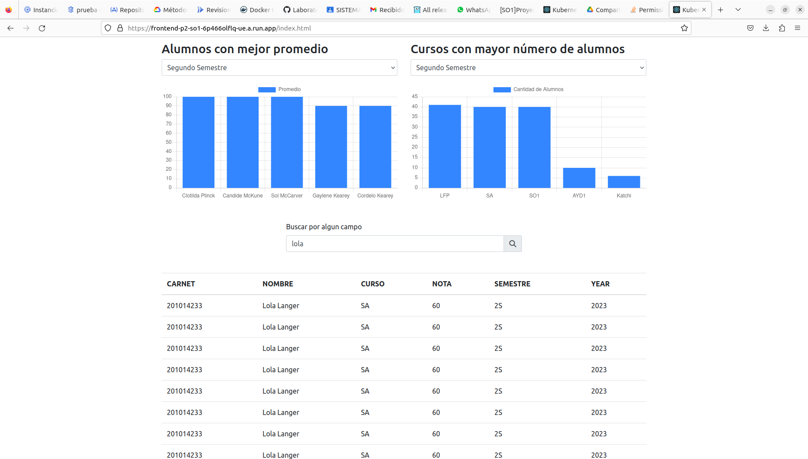
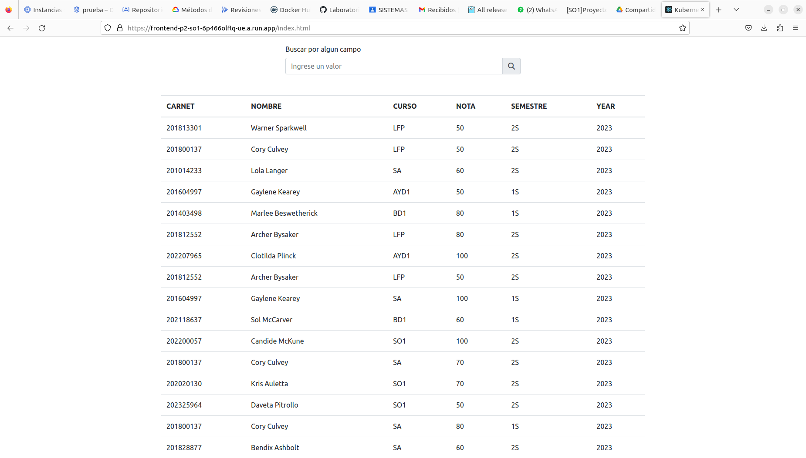
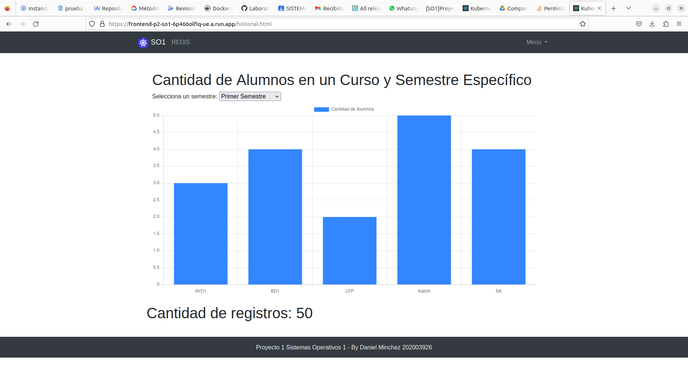

# Manual de Usuario del Sistema de Registro de Notas

## Introducción

El Sistema de Registro de Notas es una aplicación web diseñada para ayudarte a visualizar, analizar y gestionar calificaciones de alumnos en un entorno educativo. Esta guía te proporcionará una descripción detallada de las funcionalidades de la aplicación y cómo utilizarlas.

## Acceso a la Aplicación

1. Abre tu navegador web y dirígete a la URL de la aplicación.
2. Ingresa tus credenciales si es necesario o accede como invitado si está habilitada esta opción.

## Parte Estática

La parte estática de la aplicación te permite realizar las siguientes acciones:

### Visualizar el Porcentaje de Aprobación de un Curso

1. Selecciona el curso de tu interés en el menú desplegable.
2. Elige el semestre correspondiente.
3. Haz clic en el botón "Visualizar Porcentaje de Aprobación".
4. Se mostrará una gráfica circular que representa el porcentaje de aprobación y reprobación en el curso seleccionado.

### Ver Alumnos con Mejor Promedio

1. Selecciona el semestre de tu elección.
2. Haz clic en "Ver Alumnos con Mejor Promedio".
3. Se mostrará una lista de los alumnos con el mejor promedio en el semestre seleccionado.

### Ver Cursos con Mayor Número de Alumnos

1. Selecciona el semestre de tu elección.
2. Haz clic en "Ver Cursos con Mayor Número de Alumnos".
3. Se mostrará una lista de los cursos con el mayor número de alumnos en el semestre seleccionado (se mostrarán los tres principales).

### Visualizar Todos los Registros

1. Haz clic en "Ver Todos los Registros".
2. Se mostrará una tabla que contiene todos los registros de calificaciones en la base de datos. Los registros incluyen información sobre el carnet, el nombre del alumno, el curso, la nota, el semestre y el año.

## Parte Dinámica

La parte dinámica de la aplicación proporciona visualizaciones en tiempo real y permite a los usuarios acceder a las siguientes funcionalidades:

### Visualizar el Gráfico Cursos vs Número de Alumnos

1. Selecciona el semestre de tu elección.
2. Haz clic en "Visualizar Gráfico Cursos vs Número de Alumnos".
3. Se mostrará un gráfico de barras que representa la cantidad de alumnos en cada curso del semestre seleccionado.

### Visualizar la Cantidad de Registros en Redis

1. Haz clic en "Visualizar Cantidad de Registros en Redis".
2. Se mostrará la cantidad total de registros almacenados en tiempo real en Redis.

## Conclusiones

El Sistema de Registro de Notas es una herramienta valiosa que te ayuda a gestionar y analizar calificaciones académicas de manera efectiva. Las funcionalidades de la aplicación te permiten tomar decisiones informadas y obtener información relevante sobre las calificaciones de los alumnos. Esperamos que esta guía te ayude a utilizar la aplicación de manera eficaz y que encuentres útil la información proporcionada.

¡Disfruta de la experiencia de usar el Sistema de Registro de Notas y aprovecha al máximo sus capacidades!
