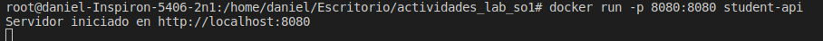

## Contruir Docket (IMAGE)

Con el comando "docker build -t nombre_docker_image ." se crea la imagen de docker.

  

## Correr imagen docker

Con el archivo dockerfile contruido previamente se ejecuta el comando "docker run -p puerto:puerto nombre_docker_image" para iniciar el servidor con docker.

  

## Mostrar las imagenes en el sistema

Por medio del comando "docker images" se visualizan las imagenes que estan creadas en el sistema.

  

## Mostrar dockers en ejecucion.

Por medio del comando "docker ps" se ilustra las imagenes de docker en ejecucion.

  

## Servidor en ejecucion

Imagen de ilustracion unicamente.

  

## Postman

Captura de la llamada a la url del servidor montado y ejecutado en docker.

  

